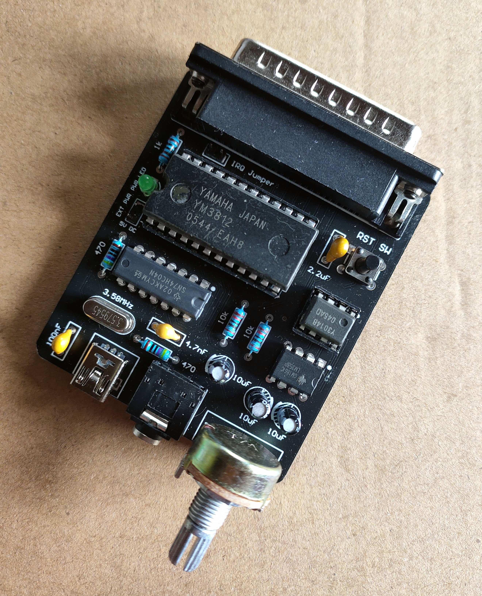
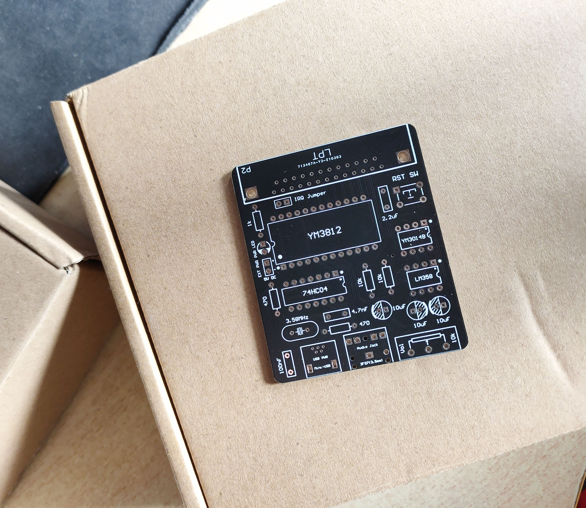

# OPL2LPT-Replica

## Introduction
**OPL2LPT-Replica** is a re-designed, open-source simplified version of OPL2LPT circuit board with fewer components under MIT license, acting as a YM3812 FM synthesizer on LPT port, and fully ***Adlib Card*** compatible.

Buy the original version of OPL2LPT and for more info: https://www.serdashop.com/OPL2LPT

## Development & Manufacture
- Please use ***Altium Designer 16*** or above to open or edit the PCB project

- Gerber files and NC drill files are already exported in `gerbers` folder, so that PCB samples can be easily manufactured

   https://www.jlc.com/ is recommended to order PCB samples in China

   
## Bill of Material

| Component                        | Designator | Quantity | Note & Possible Sources                                      |
| -------------------------------- | ---------- | -------- | ------------------------------------------------------------ |
| Leaded 100pF (101) MLCC          | C1         | 1        | Mouser 594-K101J15C0GF5UH5                                   |
| Leaded 100nF (104) MLCC          | C2         | 1        | Mouser 594-K104K15X7RF5UL2                                   |
| Leaded 10uF Pol. Cap.            | C3, C5, C6 | 3        | Mouser 667-ECA-1EM100                                        |
| Leaded 2.2uF (225) MLCC          | C4         | 1        | Mouser 81-RDER71H225K2M1H3A                                  |
| Leaded 3mm Green LED             | D1         | 1        | Mouser 630-HLMP-Y801-JPP00                                   |
| 74HC04 CMOS Inverters            | IC1        | 1        | Mouser 595-CD74HC04E                                         |
| Yamaha YM3014B DAC               | IC2        | 1        | https://www.aliexpress.com/item/32611185781.html, DIP-8 socket is recommended |
| Yamaha YM3812 OPL2               | IC3        | 1        | https://www.aliexpress.com/item/32595976031.html, DIP-24 socket is recommended |
| LM358 Dual OP Amp                | IC4        | 1        | Mouser 595-LM358AP                                           |
| Leaded Mini USB Type B Connector | P1         | 1        | Mouser 571-2172034-1                                         |
| D-Sub 25P R/A Male Connector     | P2         | 1        | Mouser 523-L717SDB25P1ACH3R                                  |
| Header 2P 2.54mm                 | P3, W1     | 2        | Mouser 855-M20-9990246                                       |
| 3F07 3.5mm Stereo Audio Jack     | P4         | 1        | https://www.aliexpress.com/i/32478957056.html                |
| 1k 1/4W Resistor                 | R1, R2, R3 | 3        | Mouser 279-YR1B1K0CC                                         |
| 10k WH148  Potentiometer         | R4         | 1        | https://www.aliexpress.com/item/32998649900.html             |
| 10k 1/4W Resistor                | R5, R6     | 2        | Mouser 279-YR1B10KCC                                         |
| TSW DIP-6\*6\*11 Key             | S1         | 1        | https://www.aliexpress.com/item/32725384168.html             |
| Crystal HC-49S 3.58MHz           | Y1         | 1        | Mouser 449-LFXTAL032257BULK                                  |

## Notes for Assembling & Testing
- 5V DC power is needed, either from Mini-USB port or external power pins

- Try to press **RST SW** to apply a manual reset when YM3812 behaves abnormal

- Detailed parameters for components are noted on the board's silkscreen

- Crystal must be 3.58MHz for accurate pitch of notes

- Using 74LS04 to substitute 74HC04 for the Pierce oscillator is not recommended

  **Note**: If the oscillator doesn't work, replace the two 1k ohms resistors around the 74HC04 IC with higher value resistors such as 4.7k ohms. Fine tuning for 100pF (101) MLCC capacitor around the 74HC04 may be also needed.

- Available open-source drivers for this project:
  - on MS-DOS: https://github.com/pdewacht/adlipt
    
    working fine using either method below
    
    - Using TSR  `adlipt`  for port mapping (with emm386.exe)
    - Using  `adpatch`  to patch part of DOS games
    
  - on Windows 3.1: https://github.com/andreiw/adlib21
## Update Logs
- Version 0.1(beta): First PCB for debugging
- Version 0.2(beta):
  - A smaller re-designed PCB
  - Audio quality improved
- Version 0.3(beta): Fix unconnected GND net for 3.5mm audio jack
- Version 1.0:
  - First version updated on https://github.com/
  - Fix power LED & volume control's problem
  - Use a round PCB corner for easier assembling (with a 3D-Printed case)
  - Pull-up resistors on bus are removed to improve compatibility for some old PCs
  - Use non-SMT Mini-USB port, making it easier to solder by hand
  - Add external 5V-DC power pins
- Version 1.0.1:
  - Add 3D-Printed case (with cover) and knob
  
    Thanks for **@zhblue** for your awesome *.stl models
  
  - Change directory structure for GitHub repo

- Version 1.1.0:
  - Fix clock problem caused by unsuitable resistors and capacitor for Pierce oscillator
  - Add Bill of Material and some images for this README document
  - Export PDF version for schematic and PCB documents

